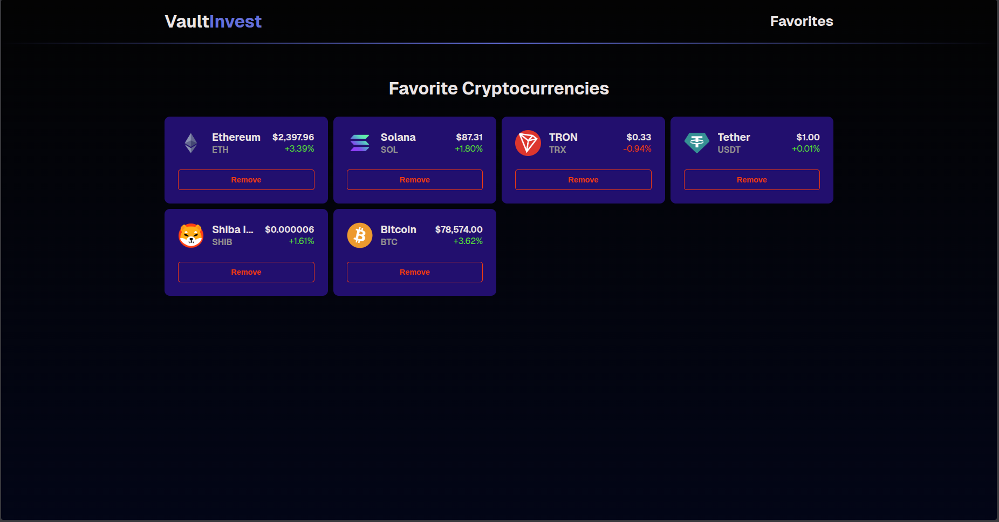

# VaultInvest 🚀

**VaultInvest** is an application designed to query and monitor the market values of top cryptocurrencies.
The project was developed as a robust Single Page Application (SPA), prioritizing a seamless user experience, responsiveness, and the integrity of the consumed data.

**Project Link:** [https://vault-invest.vercel.app](https://vault-invest.vercel.app)

---

## 💻 About the Project

The application allows users to view an organized list of digital assets, including current prices, market cap, and 24h variations. The project is structured as a high-performance Single Page Application (SPA) utilizing Vite as the build tool.

A significant technical highlight is the inclusion of **comprehensive unit and UI tests**, ensuring component reliability, alongside rigorous error handling to manage the API's Rate Limiting constraints and browser storage limits.

## 🔄 Evolution & Key Improvements

The **VaultInvest** represents a significant upgrade over its predecessor, [CryptoCoin](https://github.com/Kaua26323/CryptoCoin). This refactoring focused on implementing industry-standard practices, modernizing the stack, and ensuring application stability.

### 1. Quality Assurance & Automated Testing (Core Achievement)

The most critical milestone of this project is the introduction of a comprehensive testing suite. Unlike the previous version, VaultInvest utilizes **Vitest** and **React Testing Library** to ensure component reliability and data integrity.

- **Custom Hook Testing:** Isolated business logic testing for state management and browser storage limits (QuotaExceededError).
- **Code Coverage:** Implementation of automated reports (`npm run test:coverage`) to monitor and maintain high quality across the business logic.
- **Reliability:** Unit tests now guarantee that core features, such as search and pagination, remain functional after new updates.

### 2. State Management & Data Persistence

Introduced a robust, custom-built solution for saving favorite assets.

- **Custom Hooks (`useFavorites`):** Centralized logic to manage user preferences using the browser's `localStorage`.
- **API Batch Fetching:** The favorites dashboard uses a single API request with multiple IDs, minimizing network load and avoiding unnecessary rate limits.

### 3. Software Architecture & Separation of Concerns

Inspired by **Clean Architecture** principles, the project structure was reorganized:

- **`src/service/`**: Isolated layer for HTTP communication, decoupling API calls from components.
- **`src/hooks/`**: Reusable logic and state management.
- **`src/types/`**: Centralized TypeScript interfaces to ensure strict type safety across the entire application.
- **`src/utils/`**: Dedicated directory for pure utility functions (currency formatting), keeping the UI logic clean.

### 4. Modernized Tech Stack & Ecosystem

Upgraded to high-performance libraries to improve both user experience and bundle efficiency:

- **Notifications:** Replaced _React Toastify_ with **Sonner** for a more lightweight, performant, and elegant toast management.
- **Iconography:** Migrated from _React Icons_ to **Lucide React**, ensuring a consistent and tree-shakeable icon set.

### 5. Data Fetching & Security

Improved handling of external data:

- **API Transition:** Switched to **CoinGecko API**.
- **Resilience:** Implemented explicit logic for **HTTP 429 (Rate Limiting)**, ensuring the user receives clear, non-intrusive feedback when API limits are reached.

### 6. Advanced SEO

Implemented a robust SEO strategy using semantic HTML and metadata optimization, significantly improving search engine indexing and social media shareability compared to the initial version.

## ✨ Features

- **Current Data Querying:** Cryptocurrency listing with data fetched directly from the CoinGecko API.
- **Favorites Dashboard:** Save coins to a personal dashboard stored locally, fetching real-time prices upon visit.
- **Functional Pagination:** Navigation between different asset pages.
- **Coin Details:** Provides in-depth information about individual cryptocurrencies, such as images, and market data.
- **Asset Search:** Search bar for quickly locating specific coins.
  **Error Handling (Rate Limit & Storage):** Visual feedback via **Sonner** in case the API request limit is reached (Error 429) or browser memory is full.
- **SEO:** Use of metadata to improve site indexing and shareability.
- **Responsive Interface:** Fully adaptable layout for mobile and desktop devices using CSS Modules.

## 🛠️ Technologies Used

- **Core:** [React 19](https://react.dev/), [TypeScript](https://www.typescriptlang.org/), [Vite](https://vitejs.dev/)
- **Routing:** [React Router](https://reactrouter.com/)
- **Styling:** CSS Modules
- **Icons & UI:** [Lucide React](https://lucide.dev/), [Sonner](https://sonner.emilkowal.ski/)
- **Data API:** [CoinGecko API](https://www.coingecko.com/)
- **Testing:** [Vitest](https://vitest.dev/), [Testing Library](https://testing-library.com/)
- **Deployment:** [Vercel](https://vercel.com/)

## 🚀 How to Run the Project

### 1. Prerequisites

- Node.js (v18 or higher)
- npm or yarn

### 2. Installation

```bash
# Clone the repository
git clone https://github.com/Kaua26323/VaultInvest.git

# Navigate to the project directory
cd VaultInvest

# Install dependencies
npm install
```

### 3. Configuration

Create a .env file in the root directory with your API key.

```bash

VITE_COINGECKO_API_KEY=your_key_here
```

### 4. Execution

```bash
# Start the development server
npm run dev
```

## 🧪 Quality and Testing

The project uses Vitest to ensure the integrity of its features. To execute the test suite, you can use the following commands:

```bash
# Run all tests in watch mode (ideal for local development)
npm run test

# Run tests a single time (ideal for CI/CD pipelines)
npm run test:run

# Run tests and generate a code coverage report
npm run test:coverage

# Run all tests

npm run test

```

## 📂 Project Structure

```bash
src/
├── components/        # Reusable UI components
│ ├── Container/       # Content centralizer wrapper
│ ├── Header/          # Main application header
│ ├── layout/          # Page structure components (Layout)
│ ├── NavigationBar/   # Pagination and navigation controls
│ ├── SearchBar/       # Asset search input
│ └── TableTrElements/ # Crypto table row components
├── hooks/             # Custom React Hooks (useFavorites)
├── pages/             # Main application pages (Views)
│ ├── Home/            # Main asset listing
│ ├── CryptoDetails/   # Specific details for a coin
│ ├── Favorites/       # User's saved cryptocurrencies dashboard
│ └── NotfoundPage/    # 404 error page
├── service/           # Service layer and API integration
│ └── getCryptoData/   # HTTP calls to CoinGecko
├── types/             # TypeScript type definitions (Interfaces)
├── utils/             # Utility functions (e.g., formatters)
├── app.tsx            # Main App configuration
├── main.tsx           # Application entry point
└── routes.tsx         # Route definitions (React Router)

```

## 📸 Screenshots



